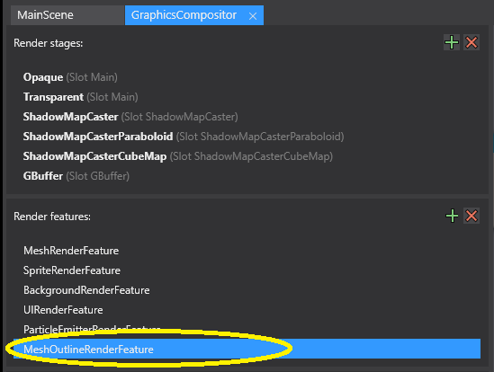

# StrideMeshOutlineRenderFeature
Mesh Outline Render Feature for Stride

This is a simple outline renderer for Stride.

1) Clone the project.
2) Explore the compositor render features (left side).
3) Expand the MeshOutlineRenderFeature (right side). Note the RenderGroupMask.
4) Explore entities in the scene with the outline entity component attached.

 
 
 

How it works:
1) Mesh outline render feature adds a dynamic shader effect to the pipeline for specific render groups.
2) Mesh outline render feature increases size of rendered objects.
3) Rendered objects are saturated to a color AND intensity specified by the outline entity component.
4) Rendered objects are rendered with CullMode.Front, so they are behind objects.

